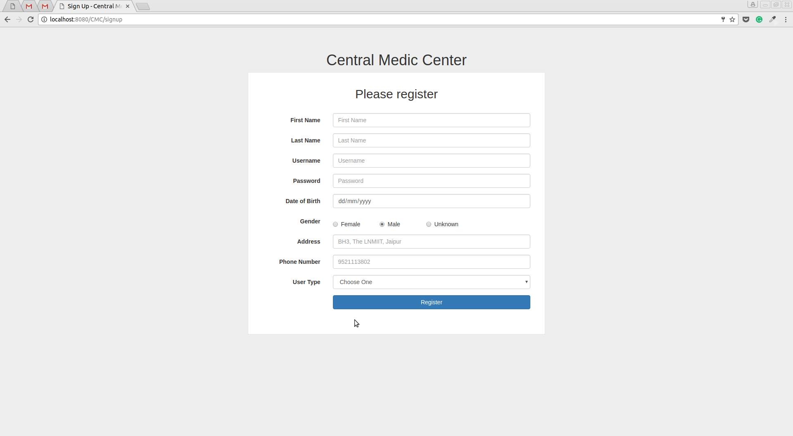

# central-medic-center
Centeral Medic Center is a Hospital Management System made for our 'OOP with JAVA'course project.

## Dashboards
* Patient
* Doctor
* Receptionist
* Lab Person
* Admin

## Technologies Used
Java, Eclipse J2EE IDE, JSP, MySQL, Apache Tomcat 8.5.

### Our Project Proposal
[SRS of CMC](./constituent/SRS_Group_38.pdf).

## Screenshots

### Patient Dashboard

### Doctor Dashboard

### Admin Dashboard

### Lab Person Dashboard

### Receptionist Dashboard

